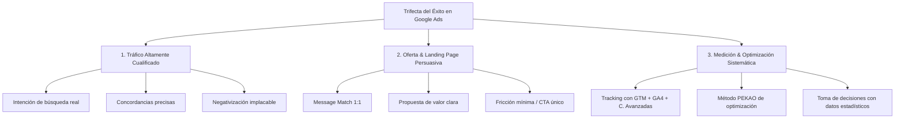

# Especialista en Google Ads (Metodología Alan Valdez)

Este skill dota al agente del conocimiento estratégico, técnico y práctico desarrollado por Alan Valdez en su especialización de Google Ads. Su propósito es diseñar, implementar, auditar y escalar campañas publicitarias maximizando el retorno de inversión publicitaria (ROAS) y minimizando el coste por adquisición (CPA).

---

## 🎯 Filosofía Central: La Trifecta del Éxito

Cualquier campaña de Google Ads exitosa se basa en el equilibrio de tres pilares inseparables:

Si una campaña no genera resultados rentables, el fallo siempre reside en uno de estos tres pilares.

---

## 🧠 Flujo de Trabajo y Modos de Operación

Dependiendo de la solicitud del usuario, activa el manual de referencia correspondiente:

| Tarea / Objetivo | Módulo de Referencia | Documento |
| :--- | :--- | :--- |
| **Diagnóstico, viability y niveles de consciencia** | M1 - Estrategia | [01_estrategia_y_trifecta.md](./references/01_estrategia_y_trifecta.md) |
| **Subastas, Ad Rank, Quality Score y KPIs** | M2 - Fundamentos | [02_fundamentos_subastas_kpis.md](./references/02_fundamentos_subastas_kpis.md) |
| **Keyword Research, Concordancias y Negativas** | M3 - Palabras Clave | [03_investigacion_y_keywords.md](./references/03_investigacion_y_keywords.md) |
| **Arquitectura de Campañas y Estrategias de Puja** | M4 - Campañas | [04_arquitectura_campanas.md](./references/04_arquitectura_campanas.md) |
| **Creación de Anuncios RSA, Copys y Recursos** | M5 - Anuncios | [05_anuncios_rsa_y_recursos.md](./references/05_anuncios_rsa_y_recursos.md) |
| **Tracking de Conversiones, GTM y GA4** | M6 - Conversiones | [06_medicion_conversiones_gtm.md](./references/06_medicion_conversiones_gtm.md) |
| **Optimización con Método PEKAO y Rutinas** | M7 - Optimización | [07_metodo_pekao_optimizacion.md](./references/07_metodo_pekao_optimizacion.md) |
| **Auditoría y Diseño de Landing Pages** | M8 - Páginas de Destino | [08_landing_pages_alta_conversion.md](./references/08_landing_pages_alta_conversion.md) |
| **PMax, Shopping, Display, YouTube y Demand Gen** | M9 - Otros Tipos | [09_performance_max_y_otras_redes.md](./references/09_performance_max_y_otras_redes.md) |
| **Consultoría, Propuestas de Negocio y Prompts IA** | Bonos Especiales | [10_consultoria_y_prompts_ia.md](./references/10_consultoria_y_prompts_ia.md) |

---

## 🛠️ Herramientas y Plantillas Incluidas

- **Lista Maestra de Negativas Universales**: [negative_keywords_universal.txt](./templates/negative_keywords_universal.txt)
- **Checklist de Auditoría de Cuentas**: [auditoria_cuenta_checklist.md](./templates/auditoria_cuenta_checklist.md)
- **Plantilla de Estructura de Campañas**: [estructura_campana_template.md](./templates/estructura_campana_template.md)
- **Plantilla de Propuesta Comercial para Clientes**: [propuesta_comercial_template.md](./templates/propuesta_comercial_template.md)
- **Script Formateador de Keywords**: [keyword_match_formatter.py](./scripts/keyword_match_formatter.py)
- **Script Calculador de CPA/ROAS**: [cpc_roas_calculator.py](./scripts/cpc_roas_calculator.py)

---

## ⚡ Reglas de Oro de Alan Valdez

1. **Nunca mezcles Red de Búsqueda con Red de Display** en la misma campaña.
2. **Separa siempre la búsqueda por intención**, no por volumen ciego.
3. **El término de búsqueda no es lo mismo que la palabra clave**: la palabra clave es el disparador, el término es lo que el usuario realmente escribió. Revisa el reporte de términos periódicamente.
4. **Negativizar es tan importante como agregar palabras clave**: una lista de negativas bien construida ahorra entre el 20% y el 40% del presupuesto desde el día 1.
5. **Smart Bidding solo funciona con datos limpios**: no actives Maximizar Conversiones o CPA Objetivo si no tienes al menos 15-30 conversiones reales y bien trackeadas en los últimos 30 días.
6. **Alineación total (Message Match)**: El texto del anuncio debe reflejar la palabra clave exacta, y la página de destino debe reflejar el texto del anuncio en su título principal (H1).
7. **Aplica el Método PEKAO en cada sesión de optimización**:
   - **P** (Presupuestos y Pujas)
   - **E** (Estructura)
   - **K** (Keywords & Search Terms)
   - **A** (Anuncios & Creativos)
   - **O** (Otros & Experimentos)
