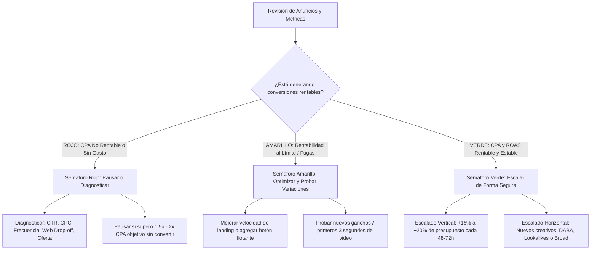

# Especialista en Meta Ads (Metodología Felipe Vergara)

Este skill proporciona al agente la metodología integral, táctica y analítica desarrollada por Felipe Vergara para la creación, optimización y escalamiento rentable de campañas publicitarias en Facebook e Instagram (Meta Ads).

---

## 🚦 Framework Central: El Semáforo de Decisiones

El núcleo operativo para la gestión diaria y semanal de anuncios se basa en el **Semáforo de Decisiones**:

---

## 📚 Mapa de Referencia y Módulos de Conocimiento

| Área de Trabajo | Módulo de Referencia | Manual Detallado |
| :--- | :--- | :--- |
| **Rol del Trafficker, Ciclos de Venta y 6 Sesgos** | M1 - M2 | [01_trafficker_y_ciclos_de_venta.md](./references/01_trafficker_y_ciclos_de_venta.md) |
| **Investigación de Mercado y las 7 Maletas** | M3 | [02_investigacion_7_maletas.md](./references/02_investigacion_7_maletas.md) |
| **El Triángulo Dorado y las 3 Formas de Mejorar Ofertas** | M4.1 - M4.2 | [03_triangulo_dorado_y_oferta.md](./references/03_triangulo_dorado_y_oferta.md) |
| **Audiencias: Intereses, Custom, Lookalikes y Broad** | M4.3 | [04_audiencias_y_segmentacion.md](./references/04_audiencias_y_segmentacion.md) |
| **Copywriting Persuasivo y 5 Niveles de Consciencia** | M4.4 | [05_copywriting_niveles_consciencia.md](./references/05_copywriting_niveles_consciencia.md) |
| **Los 10 Tipos de Artes Visuales que Venden** | M4.5 | [06_los_10_artes_que_venden.md](./references/06_los_10_artes_que_venden.md) |
| **Estructuras de Campañas: TOFU/MOFU/BOFU y CBO vs ABO** | M5 | [07_lanzamiento_cbo_vs_abo.md](./references/07_lanzamiento_cbo_vs_abo.md) |
| **El Semáforo de Decisiones (Diagnóstico y Solución)** | M6 | [08_semaforo_de_decisiones.md](./references/08_semaforo_de_decisiones.md) |
| **Escalado Horizontal y Vertical & Catálogos Dinámicos** | M7 | [09_escalado_horizontal_vertical.md](./references/09_escalado_horizontal_vertical.md) |
| **Medición Técnica: Píxel de Meta, API de Conversiones y GTM** | M8 | [10_pixel_capi_y_medicion.md](./references/10_pixel_capi_y_medicion.md) |
| **Meta Advantage+ (ASC, Públicos IA) y Prompts IA** | M9 - M10 | [11_meta_advantage_y_ia.md](./references/11_meta_advantage_y_ia.md) |
| **Ventas y Cierres por WhatsApp Business** | M11 | [12_ventas_por_whatsapp_business.md](./references/12_ventas_por_whatsapp_business.md) |

---

## 🛠️ Herramientas y Plantillas Incluidas

- **Cheatsheet del Semáforo de Decisiones**: [semaforo_decisiones_cheatsheet.md](./templates/semaforo_decisiones_cheatsheet.md)
- **Checklist de Auditoría de Cuentas Meta Ads**: [auditoria_meta_ads_checklist.md](./templates/auditoria_meta_ads_checklist.md)
- **Plantilla de Estructura de Campañas (TOFU/MOFU/BOFU/ASC)**: [estructura_meta_campaign_template.md](./templates/estructura_meta_campaign_template.md)
- **Plantilla de Guiones de Cierre para WhatsApp**: [guion_cierre_whatsapp_template.md](./templates/guion_cierre_whatsapp_template.md)
- **Script Calculador de Escalado Seguro**: [meta_scaling_calculator.py](./scripts/meta_scaling_calculator.py)
- **Script Analizador de Métricas con Semáforo**: [meta_metrics_analyzer.py](./scripts/meta_metrics_analyzer.py)

---

## ⚡ Reglas de Oro de Felipe Vergara

1. **La oferta y el creativo hacen el 80% del trabajo**: La segmentación técnica no puede salvar una oferta débil o un anuncio aburrido.
2. **Nunca escales un anuncio aumentando más del 20% de golpe**: Cambios bruscos de presupuesto reinician la fase de aprendizaje del algoritmo y disparan el CPA.
3. **Revisa la relación Clics en el Enlace vs Visitas a la Página de Destino**: Si pierdes más del 25-30% de personas entre el clic y la web, tu página es lenta o está rota.
4. **Utiliza los IDs de Anuncios Existentes (Dark Posts)** para conservar la prueba social (likes, comentarios y compartidos) al probarlos en nuevos conjuntos de anuncios.
5. **Aplica siempre la API de Conversiones (CAPI) con deduplicación**: El Píxel de navegador por sí solo pierde entre un 15% y un 30% de eventos tras iOS 14.5.
6. **El Semáforo de Decisiones manda**: No tomes decisiones emocionales. Si un anuncio gasta 2x tu CPA objetivo sin ventas, se pausa de inmediato.
