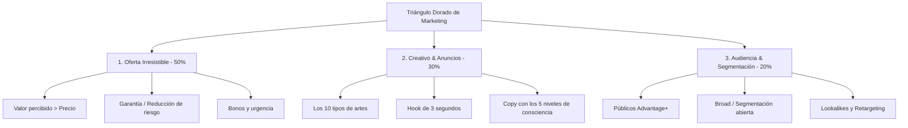

# Módulo 4 (Parte 1 y 2): El Triángulo Dorado de Marketing y la Creación de Ofertas Irresistibles

## 1. El Triángulo Dorado de Marketing

Felipe Vergara establece que toda campaña exitosa de Meta Ads es el resultado de la alineación de tres vértices indispensables:

> [!IMPORTANT]
> Si tu oferta no es atractiva o no resuelve un problema real, ningún truco de segmentación en Meta Ads logrará hacer la campaña rentable. La oferta es la base del 50% del éxito.

---

## 2. Las 3 Formas de Mejorar Cualquier Oferta

Para transformar una oferta ordinaria en una oferta irresistible (Grand Slam Offer):

### 1. Aumentar el Valor Percibido (Sin Bajar el Precio)
- **Empaquetar Bonos (Bundling)**: Agregar complementos de alto valor percibido y bajo coste marginal (plantillas, guías, asesoría inicial, accesorios, envío prioritario gratuito).
- **Resolver el Siguiente Problema**: Si vendes un software o producto, incluye una sesión de configuración o plantilla para acelerar el resultado.

### 2. Reducir Drásticamente el Riesgo (Garantías Fuertes)
- **Garantía Incondicional**: *"Pruébalo durante 30 días, si no te encanta te devolvemos el 100% de tu dinero sin preguntas"*.
- **Garantía Condicional de Resultados**: *"Si aplicas el método durante 60 días y no logras [resultado X], trabajamos contigo 1 a 1 gratis hasta que lo consigas"*.
- **Garantía de Satisfacción / Cambio Gratis**: Vital en E-commerce de moda/calzado (*"Primer cambio de talla 100% gratuito"*).

### 3. Modificar la Estructura de Precios y Pagos
- **Financiamiento / Cuotas**: Dividir el precio en 3, 6 o 12 pagos sin intereses.
- **Prueba Gratuita o Entrada de Bajo Coste (Tripwire)**: Permitir acceso de prueba por $1 o $7 antes del pago recurrente.
- **Descuento por Volumen (Tiered Pricing)**: *"Compra 1 por $30, compra 2 por $45 ($22.5 c/u)"*.
