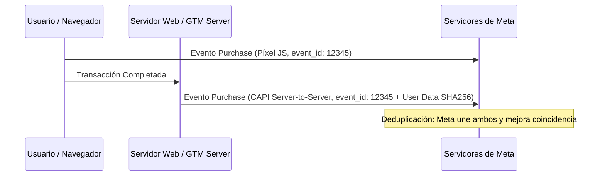

# Módulo 8: Medición Técnica con el Píxel de Meta, API de Conversiones (CAPI) y GTM

## 1. El Impacto de iOS 14.5+ y la Pérdida de Cookies de Navegador

Desde la actualización de privacidad de Apple (App Tracking Transparency - ATT), los navegadores bloquean las cookies de terceros y el seguimiento tradicional vía JavaScript del Píxel.
- **Consecuencia**: El Píxel del navegador pierde entre el **15% y el 35% de las compras o leads reales**.
- **Solución Obligatoria**: Implementar la **API de Conversiones de Meta (Conversions API - CAPI)** para enviar eventos directamente desde el servidor web a los servidores de Meta.

---

## 2. Píxel de Navegador + API de Conversiones (Tracking Híbrido Redundante)

El estándar recomendado por Felipe Vergara es el sistema híbrido:
1. El navegador envía el evento vía JavaScript (**Píxel**).
2. El servidor web envía el mismo evento vía HTTP POST (**CAPI**).
3. **Deduplicación de Eventos con `event_id`**: Ambos eventos deben compartir el mismo `event_name` y un identificador único `event_id`. Meta descarta automáticamente el duplicado y conserva la información más rápida y completa.

---

## 3. Calidad de Coincidencia de Eventos (Event Match Quality - EMQ)

El EMQ mide qué tan bien Meta puede asociar los eventos que envías con cuentas reales de Facebook o Instagram. Se califica de 1 a 10 (se busca un puntaje de **7.0 a 10.0 / Excelente**).

### Parámetros de Coincidencia Avanzada (Advanced Matching) Cifrados con SHA-256:
- `em` (Email) — El parámetro de mayor peso.
- `ph` (Teléfono con código de país, ej. `+52...`, `+34...`).
- `fn` (Nombre) y `ln` (Apellido).
- `ct` (Ciudad), `st` (Estado/Provincia), `zp` (Código postal), `country`.
- `client_user_agent` (Navegador) y `client_ip_address` (IP del cliente).
- `fbp` (Cookie de navegador de Meta) y `fbc` (ID de clic de anuncio).

---

## 4. Métodos de Instalación de CAPI y Píxel

1. **Integración con Plugins Oficiales (Shopify y WooCommerce)**:
   - Shopify: Aplicación oficial de Facebook & Instagram (configuración "Máxima").
   - WordPress / WooCommerce: Plugin oficial de Meta o plugins como PixelYourSite.
2. **Implementación vía Google Tag Manager (GTM Server-Side)**:
   - GTM Web envía evento con `event_id` generado a contenedor GTM Server alojado en Cloud / Stape.
   - GTM Server dispara la etiqueta de Meta Conversions API con parámetros hash.
3. **Verificación de Dominio y Eventos Agrupados**:
   - Verificar el dominio en la Configuración del Negocio mediante registro DNS TXT o meta tag HTML.
