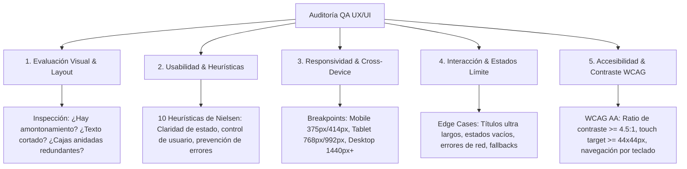

# Especialista en QA UX/UI & Auditoría de Interfaces

Este skill capacita al agente como un **Ingeniero de QA y Auditor Senior de UX/UI**, especializado en la identificación exhaustiva de fricciones de usabilidad, inconsistencias visuales, fallos de responsividad y defectos de diseño en aplicaciones web y móviles.

---

## 🔍 Framework de Evaluación Heurística y Diagnóstico QA

---

## 🚦 Matriz de Severidad de Defectos UX/UI

| Severidad | Nivel | Definición | Impacto en Usuario | Acción Requerida |
| :--- | :--- | :--- | :--- | :--- |
| **P0** | **Crítico / Bloqueante** | El usuario no puede completar la acción principal (ej. video no reproduce, botón de compra inaccesible). | Bloqueo total de la conversión o flujo. | Hotfix inmediato antes de desplegar. |
| **P1** | **Mayor / Usabilidad** | Títulos clave cortados, controles solapados, sidebar inaccesible en móviles o textos ilegibles por falta de contraste. | Frustración severa o abandono de sesión. | Corregir en la iteración en curso. |
| **P2** | **Menor / Visual** | Amontonamiento visual ("apiñado"), badges repetitivos redundantes, scrollbars toscas o micro-desalineaciones. | Degrada la percepción de calidad del producto. | Refactorizar estilos y jerarquía. |
| **P3** | **Cosmético / Pulido** | Curva de animación poco fluida, sutil falta de padding o hover state poco perceptible. | Detalle estético menor. | Pulir en fase de optimización. |

---

## 📚 Módulos de Referencia y Plantillas

| Módulo de Especialidad | Archivo de Referencia | Temas Clave |
| :--- | :--- | :--- |
| **Checklist Heurístico de Nielsen** | [01_heuristic_evaluation_checklist.md](./references/01_heuristic_evaluation_checklist.md) | Las 10 heurísticas con preguntas de validación aplicadas a interfaces web. |
| **Catálogo de Errores Visuales Frecuentes** | [02_visual_and_layout_bug_catalog.md](./references/02_visual_and_layout_bug_catalog.md) | Síndrome de apiñado, colisión de flexbox, desbordamientos y soluciones CSS. |
| **Matriz Multidispositivo y Táctil** | [03_responsive_and_cross_device_matrix.md](./references/03_responsive_and_cross_device_matrix.md) | Pruebas en resoluciones clave, zonas ergonómicas del pulgar y teclado. |
| **Plantilla de Reporte de Auditoría UX** | [04_ux_audit_report_template.md](./references/04_ux_audit_report_template.md) | Estructura profesional de hallazgos, diagnóstico y plan de acción. |

---

## 🎯 Protocolo de Auditoría Rápida (5 Pasos)

1. **Revisión en Vista Reposo (Desktop & Mobile):** ¿Se entiende de un vistazo qué hacer? ¿El título principal destaca sobre los elementos secundarios?
2. **Prueba de Estrés Tipográfico:** Insertar nombres de 80+ caracteres para verificar que el layout no se rompa (aplicación de `ellipsis` o `line-clamp`).
3. **Inspección de Estados Interactivos:** Verificar cada botón, ítem de lista y tarjeta en estado: *Default*, *Hover*, *Active/Focus*, *Disabled* y *Completed*.
4. **Verificación de Ergonomía Táctil en Móvil:** Comprobar que ningún botón o enlace tenga menos de 44x44px de área interactiva.
5. **Auditoría de Navegación por Teclado:** Validar que `Tab`, `Enter`, `Escape` y `Espacio` permitan operar el componente sin necesidad de ratón.
