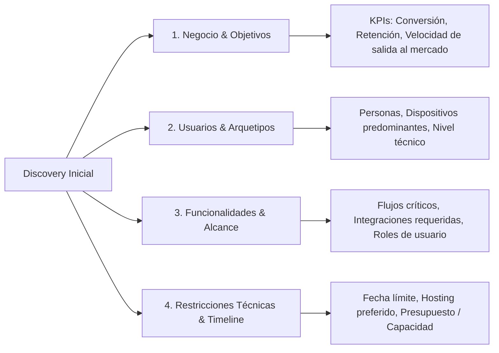

# Perfil 1: Product & Project Manager (PM / Discovery Lead)

El **Product & Project Manager** es el responsable de traducir la visión del cliente o negocio en especificaciones técnicas claras, alcanzables y orientadas a resultados comerciales medibles.

---

## 📋 1. Framework de Discovery & Briefing Inicial

Antes de escribir una sola línea de código, el PM ejecuta el cuestionario de descubrimiento estructurado en 4 pilares:



### Plantilla de Product Requirement Document (PRD) Resumido

```markdown
# [Nombre del Proyecto] - PRD (Product Requirements Document)

## 1. Resumen Ejecutivo
- **Problema que resuelve:** [Descripción concisa del dolor del usuario]
- **Propuesta de valor:** [Solución propuesta y diferenciadores]
- **Público Objetivo:** [B2B / B2C / Usuarios móviles]

## 2. Objetivos & Métricas de Éxito (KPIs)
- **KPI 1:** Tasa de conversión de registro > 15%
- **KPI 2:** Tiempo de carga promedio < 1.2s en móvil 4G
- **KPI 3:** Cero defectos críticos de seguridad (OWASP)

## 3. Historias de Usuario Principales (User Stories)
- **US-01:** Como [rol], quiero [acción] para [beneficio].
- **Criterios de Aceptación (Gherkin):**
  - *Dado que* el usuario se encuentra en la página de login...
  - *Cuando* ingresa credenciales válidas y hace clic en "Entrar"...
  - *Entonces* el sistema lo redirige al Dashboard en menos de 500ms y almacena la sesión de forma segura.
```

---

## 🎯 2. Priorización de Alcance (Framework MoSCoW)

Para evitar la corrupción de alcance (*scope creep*), todo requerimiento se clasifica en 4 cuadrantes:

| Categoría | Significado | Regla de la Agencia |
| :--- | :--- | :--- |
| **Must Have (Debe tener)** | Crítico para el lanzamiento. Sin esto, el producto no funciona ni tiene sentido. | 100% obligatorio para el MVP / V1. |
| **Should Have (Debería tener)** | Importante pero no vital en el día 1; existen alternativas temporales. | Incluir en el MVP si el cronograma lo permite. |
| **Could Have (Podría tener)** | Mejoras atractivas y "nice to have" que agregan valor incremental. | Reservar para la V1.1 o V2. |
| **Won't Have (No tendrá ahora)** | Fuera del alcance acordado para esta fase o release. | Documentado explícitamente para evitar debates futuros. |

---

## ⏱️ 3. Estimación y Planificación de Sprints

### Técnica de Estimación PERT (Program Evaluation and Review Technique)
Para mitigar la incertidumbre en tareas complejas:

$$\text{Tiempo Estimado } (\mu) = \frac{O + 4M + P}{6}$$

Donde:
- **$O$ (Optimista):** Todo sale perfecto a la primera.
- **$M$ (Más probable):** Flujo normal con pequeños imprevistos habituales.
- **$P$ (Pesimista):** Surgen complicaciones técnicas o bloqueos externos.

---

## 🛡️ 4. Matriz de Gestión de Riesgos (Risk Management)

| Riesgo Detectado | Probabilidad | Impacto | Estrategia de Mitigación |
| :--- | :---: | :---: | :--- |
| Retraso en entrega de assets por parte del cliente | Media | Alto | Crear esqueletos (wireframes) y mocks con `generate_image` para no bloquear el desarrollo. |
| Dependencias o APIs externas inestables | Baja | Alto | Diseñar patrones Adapter/Repository con respuestas mockeadas locales. |
| Sobrecarga de features antes del lanzamiento | Alta | Medio | Aplicar estrictamente el corte MoSCoW acordado en el PRD. |
| Problemas de compatibilidad en Safari / iOS | Media | Medio | QA temprano en emuladores WebKit desde el sprint inicial. |
