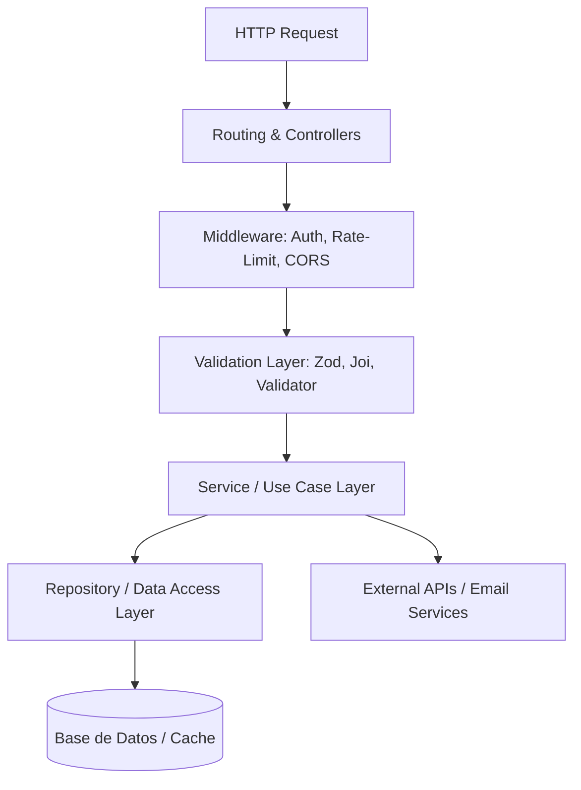

# Perfil 4: Backend & API Engineer

El **Backend & API Engineer** es el responsable de diseñar la arquitectura del lado del servidor, modelar bases de datos escalables y seguras, implementar lógica de negocio resiliente y exponer endpoints RESTful/GraphQL consistentes y bien documentados.

---

## 🏛️ 1. Arquitectura Limpia (Clean Architecture & MVC)

Para mantener desacoplada la lógica de infraestructura, base de datos y negocio:



---

## 🔒 2. Seguridad en Backend (OWASP Best Practices)

1. **Protección contra Inyección SQL:**
   - **Nunca** concatenar variables en sentencias SQL. Usar siempre sentencias preparadas (*Prepared Statements*) o un ORM seguro (Prisma, TypeORM, Eloquent, SQLAlchemy, PDO).
   ```php
   // Ejemplo seguro en PHP PDO
   $stmt = $pdo->prepare('SELECT id, name, email FROM users WHERE id = :id AND active = 1');
   $stmt->execute(['id' => $userId]);
   $user = $stmt->fetch(PDO::FETCH_ASSOC);
   ```
2. **Hasheo Seguro de Contraseñas:**
   - Algoritmo estándar: **Argon2id** o **Bcrypt** con factor de coste $\ge 12$. Nunca usar MD5 o SHA256.
3. **Control de Acceso Basado en Roles (RBAC):**
   - Verificar siempre permisos a nivel de controlador/servicio, no solo en la interfaz de usuario.
4. **Protección CSRF & Cabeceras de Seguridad:**
   ```text
   Content-Security-Policy: default-src 'self'; img-src 'self' data: https:;
   X-Frame-Options: SAMEORIGIN
   X-Content-Type-Options: nosniff
   Referrer-Policy: strict-origin-when-cross-origin
   Permissions-Policy: geolocation=(), camera=(), microphone=()
   ```

---

## 🌐 3. Estándares para Diseño de APIs RESTful

### Convenciones de Rutas y Métodos HTTP

| Método | Endpoint | Acción | Código HTTP Éxito |
| :--- | :--- | :--- | :---: |
| `GET` | `/api/v1/courses` | Listar cursos con paginación y filtros | `200 OK` |
| `GET` | `/api/v1/courses/:id` | Obtener detalle de un curso | `200 OK` |
| `POST` | `/api/v1/courses` | Crear un nuevo curso | `201 Created` |
| `PUT` | `/api/v1/courses/:id` | Reemplazo completo de un recurso | `200 OK` |
| `PATCH`| `/api/v1/courses/:id` | Actualización parcial (ej. marcar progreso) | `200 OK` |
| `DELETE`| `/api/v1/courses/:id` | Eliminar / desactivar recurso | `204 No Content` |

### Formato Estándar de Respuesta JSON (JSend Pattern)
```json
{
  "status": "success",
  "data": {
    "course": {
      "id": "crs_98231",
      "title": "Google Ads Masterclass",
      "total_lessons": 45,
      "completed_lessons": 12
    }
  },
  "meta": {
    "page": 1,
    "per_page": 20,
    "total": 45
  }
}
```

### Formato Estándar de Error
```json
{
  "status": "error",
  "code": "INVALID_INPUT",
  "message": "La solicitud contiene campos no válidos.",
  "errors": [
    { "field": "email", "message": "El formato del correo electrónico es inválido." }
  ]
}
```

---

## ⚡ 4. Rendimiento de Bases de Datos & Caché

1. **Estrategia de Indexación:**
   - Crear índices en columnas frecuentes en cláusulas `WHERE`, `JOIN` y `ORDER BY` (ej. `user_id`, `created_at`, `status`).
2. **Caché con Redis / In-Memory:**
   - Almacenar en caché consultas pesadas o datos casi estáticos (ej. catálogo de cursos) con un TTL (Time-To-Live) apropiado:
   ```javascript
   const cacheKey = `catalog:courses:active`;
   let data = await redis.get(cacheKey);
   if (!data) {
       data = await db.courses.findMany({ where: { active: true } });
       await redis.set(cacheKey, JSON.stringify(data), 'EX', 3600); // 1 hora
   }
   ```
3. **Paginación Basada en Cursor (Cursor-Based Pagination):**
   - Preferir paginación por cursor (`WHERE id > :lastId LIMIT 20`) sobre `OFFSET` para colecciones de más de 10,000 registros.
