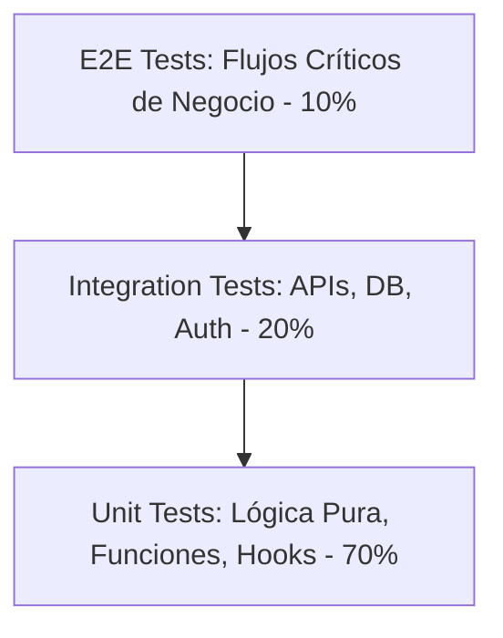

# Perfil 6: QA Engineer & Security Auditor

El **QA Engineer & Security Auditor** es el guardián inquebrantable de la calidad funcional, la usabilidad y la seguridad técnica del software antes de que cualquier entrega llegue a las manos del cliente final.

---

## 🔺 1. Pirámide de Pruebas de la Agencia



| Nivel de Prueba | Herramientas Recomendadas | Qué Valida | Cobertura Mínima |
| :--- | :--- | :--- | :---: |
| **Unit Tests** | Vitest, Jest, PHPUnit, PyTest | Funciones puras, helpers de formato, cálculo de descuentos/precios, validadores regex. | $\ge 80\%$ |
| **Integration Tests** | Supertest, Testing Library, Testcontainers | Rutas de API, middlewares de autorización, operaciones CRUD con BD real en memoria. | $\ge 70\%$ |
| **E2E Tests** | Playwright, Cypress | Flujo completo de registro, inicio de sesión, compra/checkout, visual regression. | 100% de los flujos críticos (*Happy Path*) |

---

## 🎭 2. Plantilla de Pruebas E2E con Playwright

```typescript
import { test, expect } from '@playwright/test';

test.describe('Flujo de Autenticación y Dashboard', () => {
    test('El usuario puede iniciar sesión y ver su catálogo de cursos', async ({ page }) => {
        // 1. Navegar a login
        await page.goto('/login.php');
        await expect(page).toHaveTitle(/Plataforma de Cursos/);

        // 2. Rellenar formulario local
        await page.fill('#student_name', 'Estudiante QA');
        await page.fill('#student_email', 'qa@agencia.com');
        await page.click('button[type="submit"]');

        // 3. Verificar redirección al dashboard
        await expect(page).toHaveURL(/index\.php/);
        await expect(page.locator('h1')).toContainText('Mis Cursos Disponibles');

        // 4. Verificar tarjeta de curso y badges
        const courseCard = page.locator('.course-card').first();
        await expect(courseCard).toBeVisible();
        await expect(courseCard.locator('.status-pill')).toHaveText(/Disponible/i);

        // 5. Entrar al reproductor
        await courseCard.click();
        await expect(page).toHaveURL(/player\.php\?course=/);
        await expect(page.locator('.video-wrapper')).toBeVisible();
    });
});
```

---

## 🛡️ 3. Checklist de Seguridad OWASP Top 10

Antes de autorizar el despliegue a producción (*Production Sign-Off*), el auditor de QA ejecuta este checklist:

- [ ] **A01: Broken Access Control:** Probar acceso directo por URL a recursos protegidos (`/admin/`, `/player.php?course=...`) sin sesión válida.
- [ ] **A02: Cryptographic Failures:** Verificar que todas las conexiones sean forzadas por HTTPS (`HSTS`), y que no existan passwords o tokens en texto plano en la BD o logs.
- [ ] **A03: Injection (SQL / NoSQL / Command):** Inyectar caracteres `' OR '1'='1`, `<script>`, payloads en formularios y parámetros de URL para verificar sanitización.
- [ ] **A04: Insecure Design:** Validar límites de tasa (*Rate Limiting*) en endpoints de login (`/api/auth/login`) para evitar ataques de fuerza bruta.
- [ ] **A05: Security Misconfiguration:** Desactivar `display_errors` o stack traces verbosos en entornos de producción (ocultar versiones de PHP, Nginx o Node en headers `X-Powered-By`).
- [ ] **A07: Identification and Authentication Failures:** Invalidar sesiones en el servidor al hacer logout (`session_destroy()`), y rotar IDs de sesión tras el login (`session_regenerate_id()`).
- [ ] **A08: Software and Data Integrity:** Verificar firmas de paquetes `package-lock.json` / `composer.lock` con escaneo de vulnerabilidades (`npm audit`, `composer audit`).
- [ ] **A09: Security Logging and Monitoring:** Confirmar que intentos fallidos de login o accesos no autorizados queden registrados en un archivo log protegido.
- [ ] **A10: Server-Side Request Forgery (SSRF):** Validar y restringir cualquier URL externa enviada por el usuario para prevenir consultas a `http://localhost/` o metadatos de AWS/Cloud.

---

## 📋 4. Matriz de Clasificación de Defectos (Bug Severities)

| Nivel de Severidad | Criterio | Tiempo Máximo de Corrección | Bloquea Lanzamiento? |
| :--- | :--- | :---: | :---: |
| **P0 - Crítico / Blocker** | Caída del servidor, vulnerabilidad grave de seguridad, pérdida de datos, checkout roto. | Inmediato (< 2h) | **SÍ (100%)** |
| **P1 - Alto** | Funcionalidad principal rota sin alternativa viable para el usuario. | < 8h | **SÍ** |
| **P2 - Medio** | Funcionalidad secundaria con comportamiento anómalo o alternativa disponible. | < 24h | NO (si hay workaround) |
| **P3 - Bajo / Cosmético** | Desalineación menor de 2px, texto con typo menor, animación con pequeño glitch. | Próximo Sprint | NO |
